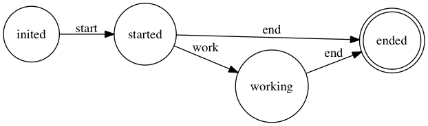

FSM - Finite-state machine
===========================

## usage
```sh
go get github.com/yandd/fsm
```

## example


```go
f, err := NewFSM("inited", []interface{}{"ended"}, FSMEvents{
	{Name: "start", From: "inited", To: "started"},
	{Name: "work", From: "started", To: "working"},
	{Name: "end", From: []interface{}{"started", "working"}, To: "ended"},
})
```
